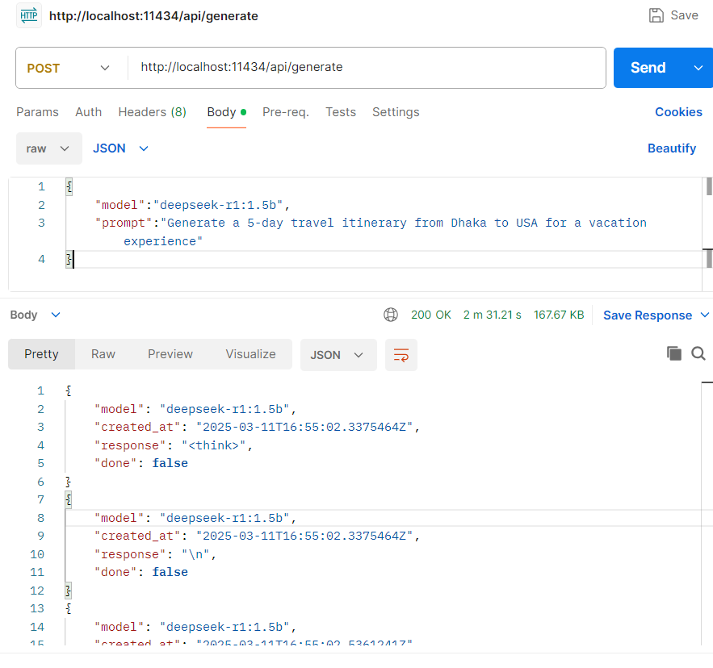

### Build and Serve a Deepseek-R1 or Llama AI Chatbot Locally Using Ollama and Spring Boot

In this guide, we’ll walk you through setting up a local AI chatbot using  **Deepseek-R1**  or other popular models like  **Llama**. We’ll use  **Ollama**  to run the model locally and serve it via a  **Spring Boot**  application. This setup allows you to create a web-based interface for interacting with the AI model.

----------

### Step 1: Install Ollama

First, download and install  **Ollama**  from their official website:  [https://ollama.com](https://ollama.com/). Ollama is a lightweight tool that makes it easy to run large language models locally.

----------

### Step 2: Run the Deepseek-R1 Model

Once Ollama is installed, you can run the  **Deepseek-R1:1.5b**  model, which is a compact yet powerful model with  **1.78 billion parameters**  and a size of only  **1.1GB**. To start the model, use the following command:

    ollama run deepseek-r1:1.5b

You can find more details about the model here:  [Deepseek-R1 on Ollama](https://ollama.com/library/deepseek-r1:1.5b).

----------

### System Requirements

-   **8GB RAM**: Required to run 7B parameter models.

-   **16GB RAM**: Required to run 13B parameter models.

-   **32GB RAM**: Required to run 33B parameter models.

For  **Deepseek-R1:1.5b**, a commodity machine with  **8GB of RAM**  is sufficient to run the model efficiently.

----------

### Step 3: Test the Model API

After running the model, you can interact with it via its REST API. For example, you can use  **Postman**  or any REST client to send a request. Here’s an example using  `curl`:

    curl --location 'http://localhost:11434/api/generate' \
    --header 'Content-Type: application/json' \
    --data '{
        "model": "deepseek-r1:1.5b",
        "prompt": "Generate a 5-day travel itinerary from Dhaka to USA for a vacation experience"
    }'
The output looks like :

----------

### Step 4: Build a Spring Boot Application

The raw response from the model might not be easily readable. To improve the user experience, we can create a  **Spring Boot**  application to:

1.  Filter and format the response.

2.  Expose the chatbot as a web service.

#### Key Considerations:

1.  **Non-Blocking Code**: Since the model can take a few minutes to respond, ensure your Spring Boot application uses non-blocking code. For example, the  `getItinerary`  method should return a  `Mono<String>`  to handle the eventual promise.

2.  **Request Timeout**: Increase the request timeout in your  `application.properties`  file to accommodate longer response times:

> spring.mvc.async.request-timeout=300000

#### Example Spring Boot Code:

Here’s a snippet of a simple implementation, the demo code is here: ([nahidshahin/ollama-demo](https://github.com/nahidshahin/ollama-demo)):

    webClient.post()  
            .uri("/api/generate")  
            .contentType(MediaType.APPLICATION_JSON)  
            .bodyValue(new AIRequest(aiModel, prompt))  
            .retrieve()  
            .bodyToFlux(String.class)  
            .map(jsonString -> {  
                JsonNode jsonNode = null;  
                try {  
                    jsonNode = new ObjectMapper().readTree(jsonString);  
                } catch (JsonProcessingException e) {  
                    throw new RuntimeException(e);  
                }  
                return jsonNode.get("response").asText();  
            })  
            .filter(response -> !response.isEmpty())  
            .reduce(String::concat)

----------

### Step 5: Expose the Application to the Web

Once your Spring Boot application is ready, you can deploy it locally or on a cloud platform. Use tools like  **Ngrok**  to expose your local server to the internet, or deploy it on platforms like  **Heroku**,  **AWS**, or  **Google Cloud**.

----------

### Performance Notes

-   **Response Time**: The  **Deepseek-R1:1.5b**  model took  **2 minutes and 31 seconds**  to generate a complete response in our tests. Ensure your application handles such delays gracefully.

-   **Scalability**: For production use, consider optimizing the model or using a more powerful machine to reduce response times.

----------

### Conclusion

By following this guide, you can set up a local AI chatbot using  **Deepseek-R1**  or similar models, serve it via a  **Spring Boot**  application, and expose it to the web. This setup is ideal for experimenting with AI models or building custom chatbot solutions.

